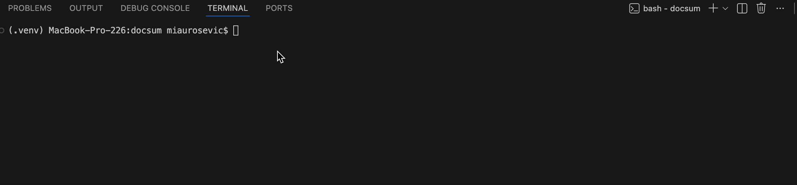

# Local Project Chat Agent

An AI-powered command-line coding agent for exploring and modifying git repositories with natural language and local tool calling. It safely reads project files, writes changes back to the repo, runs doctests, and records its edits as git commits.


[](https://pypi.org/project/lab-more-project-chat/)

---

## Demo



---

## Features

- Safe local read and write tools with path validation that blocks absolute paths and traversal attacks
- Manual slash commands and automatic LLM tool use
- Repository-aware startup checks with automatic `AGENTS.md` loading
- File creation, multi-file writes, file deletion, doctest execution, and optional package installs
- Automatic git commits for agent edits with `[docchat]` commit messages
- One-shot CLI usage, `--debug`, `--provider`, and slash-command tab completion
- Extra credit support for `pip_install` and a doctest retry loop that keeps going until doctests pass
- Full testing suite with doctests, integration tests, flake8, and coverage

---

## Installation

```bash
pip install .
docchat
```

## Usage

```bash
docchat
docchat "what is 2 + 2?"
docchat --debug "what files are in the .github folder?"
docchat --provider groq "show me README.md"
```

## Example: Create A File
This example is good because it proves the agent can create a new file and automatically record the change as a git commit.

```bash
$ ls -a
.git
AGENTS.md
README.md
$ git log --oneline -1
c21103f init commit
$ docchat
chat> Create a Python file named hello.py that prints hello world.
Committed 3cfb0a6 with message: [docchat] create hello world script
chat> ^C
$ ls
README.md
hello.py
$ git log --oneline -1
3cfb0a6 [docchat] create hello world script
```

## Example: Update A File
This example is good because it shows the agent modifying an existing tracked file, rerunning doctests, and saving the result as a new commit.

```bash
$ cat calc.py
"""
>>> add(2, 2)
5
"""
$ docchat
chat> Fix the doctest failure in calc.py.
Committed 5a8d9e1 with message: [docchat] fix add doctest
$ git log --oneline -1
5a8d9e1 [docchat] fix add doctest
$ python -m doctest -v calc.py
1 items passed all tests:
   1 tests in calc.py
1 tests in 1 items.
1 passed and 0 failed.
Test passed.
```

## Example: Delete A File
This example is good because it demonstrates safe removal through the agent and shows that deletions are committed too.

```bash
$ ls
draft.txt
keep.txt
$ docchat
chat> Delete draft.txt.
Committed 8bf42a0 with message: [docchat] rm draft.txt
$ ls
keep.txt
$ git log --oneline -1
8bf42a0 [docchat] rm draft.txt
```

## Example: Webscraping Project
This example is good because it shows the agent answering a high-level question about a real previous project.

```bash
$ cd test_projects/webscraping_project
$ docchat "what is this project about?"
The project is designed to scrape product data from eBay listings, including titles, prices, and links.
```

## Example: Markdown Compiler
This example is good because it shows the agent inspecting implementation details across source files.

```bash
$ cd test_projects/markdown_compiler
$ docchat "find def in *.py"
def compile_markdown(file_path):
def parse_headers(text):
def render_html(content):
```

## Example: Mia.Urosevic.github.io
This example is good because it shows the agent reading and summarizing files from a real webpage project.

```bash
$ cd test_projects/Mia.Urosevic.github.io
$ docchat "show me README.md"
This project is a personal website built using HTML, CSS, and JavaScript.
```
